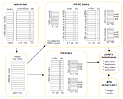
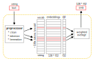
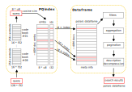
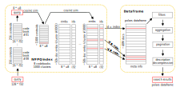
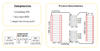
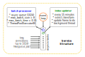
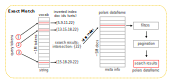
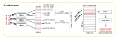

#### Search Engine (vector index)
Fast and efficient vector search engine for Service Manager. Objects in index: requests, incidents, and problems (~40M items, ~2.5 years). Features: ~300 requests / sec, ~6 Gb of RAM, ~2.5 Gb of disk space. Dependencies: lxml, psycopg2, pymorphy2, asyncio, aiohttp, youtokentome, numpy, polars, gensim, faiss-cpu.
  

 

##### Text Vectorization
Document embeddings are constructed with a simple weighted averaging technique (Word2Vec token embeddings + IDF weights). Future plans: switch to TinyBert (Custom Tokenizer, Dynamic MLM, TripletLoss).
  

 

##### PQ Index Search
This type of search is more accurate (higher recall), but significantly slower (requires more processing time). The actual search is performed on all the embeddings in index (exhaustive search).
  

 

##### IVFPQ Index Search
This type of search is less accurate (lower recall), but significantly faster (requires less processing power). All the embeddings are separated into 1000 clusters. The most simmilar centroids (one or several clusters) are found firstly, and then the actual search is performed only inside those clusters.
  

 

##### Compression
In order to reduce memory consumption and increase speed, several data compression techniques are used: string cache for categoricals (polars), BPE encoding for descriptions (youtokentome), and product quantization for embeddings (faiss). Total memory reduction ratio: ~10x.
  

 

##### Service Structure
Basically, this is an aiohttp web server application with 2 background tasks: index updater and batch processor. The last one implemented this way mostly because of the future plans to switch to TinyBert.
  

 

#### Search Engine (Inverted Index)
Fast and efficient inverted index search engine for Service Manager. Objects in index: contacts, departments, and services (~5M items, ~2.5 years). Features: ~800 requests / sec, 5 Gb of RAM, 2 Gb of disk space. Dependencies: dawg, psycopg2, pymorphy2, asyncio, aiohttp, numpy, polars.   

##### Exact Match Search
An inverted index is basically a mapping from tokens to sets of documents (ids).
At its simplest, it might be just a dictionary of sets. The only drawback is the memory consumption, but it could be addressed with roaring bitmaps and other similar data structures and approaches.
  

 

##### Prefix Match Search
Basically, the same as the exact match search, but now the query tokens are treated as prefixes and used as input for the completion DAWG. Almost the same speed, but much more flexible in some cases.
  

